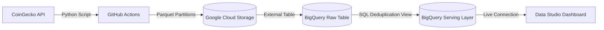
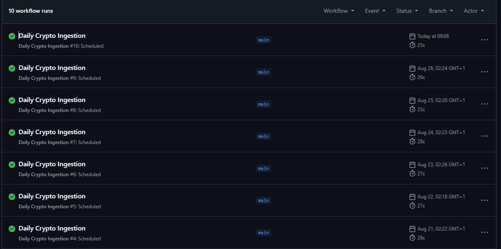
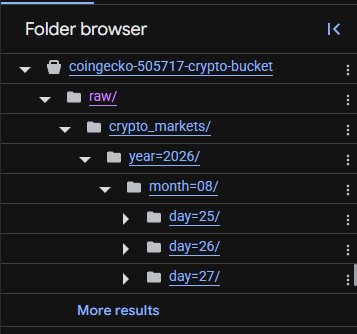
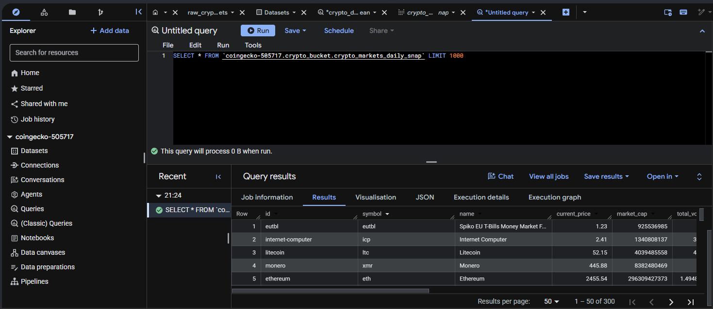
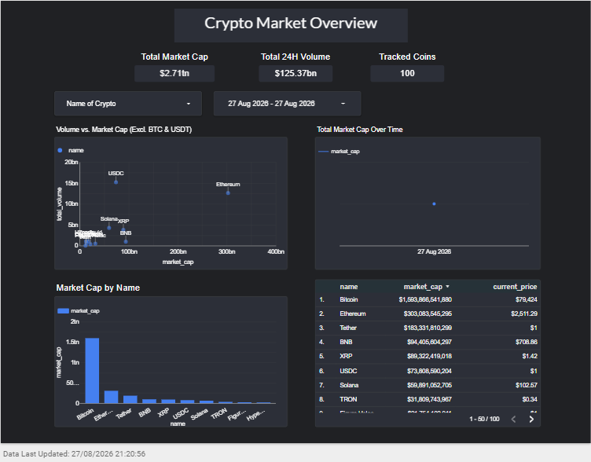

# Automated Crypto ELT Data Pipeline and Analytics Project

This is an end-to-end cloud data pipeline which extracts cryptocurrency data from the CoinGecko API.
It stores raw data in a partitioned data lake on Google Cloud Storage Platform, transforming and de-duplicates records using BigQuery, then allows the user to see market trends in Google Data Studio. This is fully provisioned by Terraform and automated with GitHub actions.

## Overview


## Features

### 1. Extraction and Automation
* Runs daily via GitHub Actions
* Extracts top 100 coin data (price, market cap, 24hr vol) from CoinGecko
* Completes in under 30 seconds
<div align="left">
  
</div>

### 2. Data Lake Partitioning
* Ingest script converts data into `.parquet` files and uploads to GCS
* These files are organised into partitions (year, month, day) to minimise query costs
<div align="left">
  
</div>

### 3. Data Transformation
* De-duplicates records using SQL window functions in BigQuery
```sql
SELECT *
FROM `project_name.crypto_bucket.raw_crypto_markets`
QUALIFY ROW_NUMBER() OVER (
  PARTITION BY id, snapshot_date 
  ORDER BY extracted_at DESC
) = 1;
```
<div align="left">
  
</div>

### 4. Infrastructure as Code
* Terraform allows cloud resources to be reproduced seamlessly

### 5. Dashboard
* Google Data Studio dashboard
* Has interactive date ranges, specific coin tracking, and graphs for analysis
* Includes the cleaned database for further analysis
<div align="left">
  
</div>

## Setup
### Requirements
* GCP Account
* Terraform 1.5.0+
* Python 3.10+

### 1. Clone repository
```sh
git clone [https://github.com/](https://github.com/)<your-username>/coingecko-data-engineering-project.git
cd coingecko-data-engineering-project
```
### 2. GCP Setup
1. Create a new GCP Project
2. Create a service account with roles:
    * Storage Admin
    * BigQuery Admin
3. Generate a JSON Key and place it in /terraform with the name `USER_KEY.json`
### 3. Change Terraform Variables
1. Navigate to terraform directory
2. in `vars.tf` change the proj_name `default` to your own project GCP project id name
### 4. Deploy the Cloud Infrastructure
Make sure you're in /terraform directory in your terminal and run these commands in succession
```sh
terraform init
terraform apply
yes
```
### 5. GitHub Actions
1. Go to GitHub repository Settings > Secrets and Variables > Actions
2. Make a new secret called USER_KEY and paste your `USER_KEY.json` content into the field
3. Save


